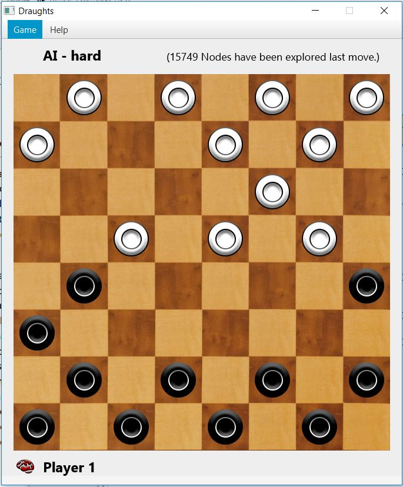
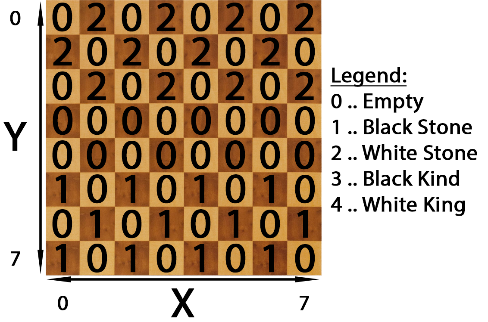

# Introduction

For this project I created a draught game with two players. The players can be selected freely and are either human or AI opponents chosen from a scale of available skill levels. This allows the game combinations “Human vs. Human”, “Human vs. AI” and “AI vs. AI”. The interface can be seen in the picture below. The menu bar contains options to start a new game or show the rules under “Help”.

I identified four major parts of the game and developed it accordingly. The **state** of the game (class *State*) represents the position on the board and the available moves. The **GUI** (classes *UI* and *SelectionScreen*) handles the visualisation and user in- and output. The **evaluation** of a board position (class *Analysis*) calculates the value of a game state to allow the AI to find good moves. The **search** for such a move is part of the class *Player*. A log file and the console output record relevant events throughout the game.

# Game State

The class *State* is the core of the game and includes the entire game logic. It contains a board with pieces on it, a value determining which player’s turn it is, information about ongoing capturing sequences, and a list with all possible moves in the current situation. 

The board is represented by a 2-dimensional integer array as shown below.  The help classes *Position* and *Move* are used to unify the information within the state class. A position includes a X – and a Y – coordinate, which represent the location on the board. A move consists of a source and a target position.

Capturing sequences occur when a player can hit multiple enemy pieces in a row. Each of these hits is a move on its own, resulting in an independent game state. In these cases, the position of the hitting piece is stored as *lastHit*, so that the following state can ensure that only this piece can be moved to finish the sequence. If there is no capturing sequence active, the position is set to a NULL value.

In order to allow interaction with the GUI and other classes, the *State* provides a list with legal moves, which lead to the valid successor states. This list could be calculated whenever it is requested, but since this might occur multiple times for each state, I decided to focus on the optimisation of computing time and calculate the available moves only once per state to store them in a list. This entails the risk, that the board might be manipulated without the move list being updated, resulting in an invalid list. Therefore, the board state is only changed when a move is played, which involves a recalculation of the move list after completion. 

The legal moves are calculated as shown above (Appendix C, line 439). First, all pieces of the player who’s turn it is are located (Appendix C, line 372). In case of an ongoing capturing sequence, only the last moved piece is considered. Next, all possible moves of these pieces are estimated (Appendix C, line 333). This is done by checking for free squares and enemy stones to capture in all possible directions (Appendix C, line 293). If the list of available moves contains any capturing moves, all non-capturing moves are removed.

The board is manipulated by sending a move to the game state. The validity of the move is ensured by checking if the list of legal moves contains it. If the move is valid, the board is manipulated accordingly (Appendix C, line 88): As shown in the last picture, the source position of the move is cleared and the piece is moved to the target position. If the move was a capturing move, the according position is cleared as well. In case there is another capture possible by that piece, the position of the piece is saved to initiate a capturing sequence and the new game state is returned without changing turns. Otherwise, the moved piece is promoted if possible (Appendix C, line 255), the capturing sequence is reset, and the turn is changed. In both cases, the new list of legal moves is calculated.

There are a few other publicly accessible methods: The clone method allows the minimax search algorithm to pass down copies of the game state and methods to show all available source positions (Appendix C, line 122) and target positions from a certain selected position (Appendix C, line 144) are used by the GUI to provide information for human players.

# Evaluation

The analysis (Appendix D) is responsible for calculating a numerical value of a board state. This static evaluation is used by AI players to find the optimal move. Positive values mean the situation is in the favour of the black player and negative values signal a good position for white. For this static evaluation I selected the most relevant features, inspired by the results of Kusiak, Waledzik, \& Mandziuk (2007). Each piece has a value depending whether it is a king or a pawn (Appendix D, line 139). If it is a pawn, it is valued higher the closer it is to the promotion line. An already promoted piece has the highest possible value in this category. Pieces get bonus points for being able to hit enemy pieces and for having connections with friendly pieces, since pieces in such connected shapes are able to protect each other. Furthermore, Players get points if it is their turn and for the size of the area which they cover with their pieces. For the latter, each position on the board has a value of $1$, which is credited to the player who has a piece closest to that position (Appendix D, line 91). If both players have their closest piece in the same distance, none of them gets the point. This is especially helpful in the endgame when there are only few pieces left and an AI with a low difficulty rating would need a few moves just to get near enemy pieces. Instead of moving aimlessly around it now tries to cover space and thus pushes the enemy pieces into corners.

# Player

A player can be human or an AI. The latter has different difficulty settings which represent the search depth. An AI with “hard” difficulty occasionally will take 30s – 70s to calculate the next move, a “brutal” AI can take much longer and is not recommended to be used. The player class (Appendix E) has some attributes which support the search and the GUI. It stores the threshold value which is used to shorten the current search, counts the number of explored nodes and has a Boolean value to determine if the player is still active. The latter one is used to interrupt the move calculation in case the game is aborted before it is finished.

## AI Move

The beginning of a game of draughts is considered to be "boring" (Schaeffer et al, 2007) and therefore, the first three moves are selected randomly. After that, a dynamic evaluation in form of a minimax search is used to determine the next move of the AI. The top layer of the search (Appendix E, line 139) initiates a minimax search for all available moves from the current game state and stores the results. Once it is finished, it returns the move with the best outcome. If there are multiple moves with the same estimated outcome, one of them is randomly selected and returned.

The minimax function (Appendix E, line 79) receives the current depth, the game state, alpha, and beta. It creates a copy of the game state for each possible move, applies it and calls itself with that copy recursively until a stopping criterion, such as reaching the maximum search depth, is met. The search depth depends on the difficulty setting and can be found in Appendix E, line 61. 

\begin{table*[h!]
	\centering
	\begin{tabular*{ | m{9em* | m{1.6cm* | m{3cm* | m{3cm* | * 
 		\hline
	 	 & Interval & Nodes explored & Time elapsed \\ 
	 	\hline
	 	$\alpha-\beta$ pruning & - & 1,221,093 & 49.258s \\ 
 		\hline
 		$\alpha-\beta$ pruning + threshold pruning & 3 & 861,476 & 38.860s \\ 
		 \hline
 		$\alpha-\beta$ pruning + threshold pruning & 4 & 807,042 & 33.437s \\ 
		 \hline
 		$\alpha-\beta$ pruning + threshold pruning & 5 & 980,391 & 37.901s \\ 
		 \hline
 		$\alpha-\beta$ pruning + threshold pruning & 6 & 1,014,694 & 39.361s \\ 
		 \hline
	\end{tabular*
	\caption{Comparison of different pruning settings for the minimax search of an AI with the search depth = 9. "Interval" refers to the frequency of the threshold being checked. The situation is calculating the best move in the initial board setting.*
	\label{tab:comp*
\end{table*

The search is pruned in two ways: On the one hand by alpha-beta pruning and on the other hand by a threshold value. The threshold values are determined by calculating the value of the initial board position and reducing it by a buffer value of 15 to estimate the lower threshold and adding the buffer value for the upper threshold. If the value of a position in the search tree exceeds these thresholds, the successor states of that position will not be explored. The idea behind this is, that such a position is clearly in favour of one player and the other player would aim to find moves with a better outcome anyway.

However, since the evaluation of a position consumes processing power as well, the threshold is only checked every 4 steps in order to optimise the search performance. As shown in Tab. \ref{tab:comp*, this can reduce the time to calculate a move by almost 40\% in an equal position.

\begin{figure*[!htb]
	\centering
	\includegraphics[width=0.5\linewidth]{minmaxBottom.png*
	\caption{The minmax recursion ends where a win/loss is found or when the set search depth is reached. At each depth which is dividable by 4, the current state is analysed and only further explored if its value does not exceed certain thresholds.*
	\label{fig:bottom*
\end{figure*

 <figure>
  
  <figcaption>Fig. 4: The minmax recursion ends where a win/loss is found or when the set search depth is reached. At each depth which is dividable by 4, the current state is analysed and only further explored if its value does not exceed certain thresholds.</figcaption>
 </figure>

The bottom of the search is reached either if the maximum search depth based on the difficulty setting is reached or when the game ends. A player has won, if the opponent player is unable to move. This can occur when they either have no pieces left on the board or all their pieces are blocked. If the minimax search reaches a position without legal moves, the evaluation value for that position is set to the worst possible outcome, which is minimally buffed by the search depth (Fig. 4). This way a loss in two moves is lower rated than one in twenty moves, so that the AI looks for the shortest possible wins and delays their defeat for as long as possible. Otherwise it might do a move which will end in certain defeat in five rounds, just because the other available move seems to end in a complex defeat in ten rounds. A move sequence a human might not have seen.

# GUI

The design of the user interface is inspired by Lichess[^1]. This includes the colour scheme and the board, which is copied from the web application. The game pieces were designed using Adobe Illustrator.

The interface was developed using JavaFX and is split into the two classes *UI* (Appendix F) and *SelectionScreen* (Appendix G). The latter one changes the game stage to a screen which allows the user to select two players, define the difficulty settings, and start the game.

The game itself is in the main class. Once called, it initialises the players and draws the board (Appendix F, line 573). If the player, whose turn it is, is human, their pieces can be moved via drag-and-drop. This is realised by implementing draggable objects (Appendix F, line 682) and objects which can receive these objects (Appendix F, line 715). In case a human player tries to play an invalid move, that move is rejected and until a legal move is played, *highlighting* will be active. This supports the player by marking legal source positions with a purple square and legal target positions with a green square. As long as highlighting is inactive, a player can drag-and-drop a piece of their colour, which cannot legally move. Once highlighting is active, only legal source pieces can be selected for drag-and-drop. I figured it is more intuitive and less invasive to first be able to do a wrong move before being restricted by the assistant.

In case it is the AI’s turn, a new thread is started to calculate the next move (Appendix F, line 417). This is necessary because otherwise the application thread would be frozen and unresponsive while the move is being calculated. Once the next move is picked, it is passed back to the application thread, which creates another sub-thread to animate a smooth transition of the piece over the board. The game was developed and tested on Windows 10 and also runs on Mac OS X. However, the piece movement seems to work very inconsistently on OS X. A lot of the times pieces just jump to their position.

The rules screen can be accessed via the menu bar (Appendix F, line 276). The content is loaded from the text file "rules.txt" in the game folder and can be changed there (Appendix F, line 205).

When the game finishes, a screen pops up (Appendix F, line 234), displaying the winner and offering an immediate rematch or a new match, which involves selecting new players. New games can also be started via the menu bar at the top of the game window.

The main screen also shows the player names, who’s turn it is (symbolised by a red gear or brain symbol) and how many nodes were explored by AI players for the last move. Additional information like the evaluation of the current position, available moves, and calculation time can be found in the console, which is used for development purposes and is not part of the game. It can be excluded from the game by changing two lines of code, but I preferred to include it since it offers valuable insight into the game.

[^1]: https://lichess.org/

# References

Kusiak, M., Waledzik, K., & Mandziuk, J. (2007). Evolutionary Approach to the Game of Checkers. *Adaptive and Natural Computing Algorithms Lecture Notes in Computer Science*, 432-440. doi:10.1007/978-3-540-71618-1\_48\\

Schaeffer, J., Burch, N., Bjornsson, Y., Kishimoto, A., Muller, M., Lake, R., Lu, P., & Sutphen, S. (2007). Checkers Is Solved. *Science, 317*(5844), 1518-1522. doi:10.1126/science.1144079\\
